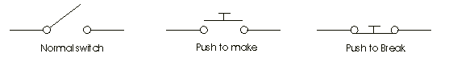
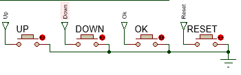

Muhammad Wahyudin

140310120031

22 Desember 2015

PROGRAM STUDI FISIKA

FAKULTAS MATEMATIKA DAN ILMU PENGETAHUAN ALAM

UNIVERSITAS PADJADJARAN

2015

**
**

**Daftar Tabel**
----------------

[Tabel 1. Deskripsi pin AT89C51 7](#_Toc438592912)

[Tabel 2. Deskripsi pin ADC0804 11](#_Toc438592913)

[Tabel 3. Contoh instruksi (symbol) dalam bahasa assembly 17](#_Toc438592914)

**Daftar Gambar**
-----------------

[Gambar 1. Arsitektur mikrokontroler AT89C51 6](#_Toc438599009)

[Gambar 2. Pin AT89C51 7](#_Toc438599010)

[Gambar 3. Diagram koneksi ROM, RAM, CPU 9](#_Toc438599011)

[Gambar 4. Diagram port input/output 9](#_Toc438599012)

[Gambar 5. Diagram Komunikasi Serial 10](#_Toc438599013)

[Gambar 6. Diagram dan karakteristik LM35 10](#_Toc438599014)

[Gambar 7. Rangkaian pengondisi sinyal LM35 11](#_Toc438599015)

[Gambar 8. Diagram pin dan skematik ADC 0804 11](#_Toc438599016)

[Gambar 9. Diagram konstruksi pushbutton 13](#_Toc438599017)

[Gambar 10. Skematik LCD1602 13](#_Toc438599018)

[Gambar 11. Kode perintah LCD 13](#_Toc438599019)

[Gambar 12. Ilustrasi relay elektromekanik 14](#_Toc438599020)

[Gambar 13. Ilustrasi kerja motor DC sederhana 14](#_Toc438599021)

[Gambar 14. Elemen pemanas pada PROTEUS 15](#_Toc438599022)

[Gambar 15. Diagram data protokol UART 16](#_Toc438599023)

[Gambar 16. Kiri: Level tegangan RS232, Kanan: Koneksi MAX232 dengan mikrokontroler 16](#_Toc438599024)

[Gambar 17. Struktur dasar bahasa assembly 17](#_Toc438599025)

[Gambar 18. Tampilan utama VSPE 18](#_Toc438599026)

[Gambar 19. Pembuatan koneksi "pair" antar virtual COM pada VSPE 18](#_Toc438599027)

[Gambar 20. Pemilihan nomor Virtual COM yang akan dihubungkan pada VSPE 19](#_Toc438599028)

[Gambar 21. Skematik sistem pengontrolan 21](#_Toc438599029)

[Gambar 22. Peta pin I/O yang digunakan pada AT89C51 22](#_Toc438599030)

[Gambar 23. Kiri: Setting crystal 12Mhz, Kanan: source code microcontroller di PROTEUS 23](#_Toc438599031)

[Gambar 24. Sub bagian sensor LM35 dan ADC 24](#_Toc438599032)

[Gambar 25. Sub bagian LCD1602 25](#_Toc438599033)

[Gambar 26. Tampilan LCD ketika sistem berjalan 25](#_Toc438599034)

[Gambar 27. Sub bagian Serial Communication 28](#_Toc438599035)

[Gambar 28. Kiri: Setting virtual terminal, Kanan : Setting COMPIM (DB9) 28](#_Toc438599036)

[Gambar 29. Tampilan virtual terminal ketika sistem berjalan 28](#_Toc438599037)

[Gambar 30. Sub bagian kontrol 4 pushbutton 29](#_Toc438599038)

[Gambar 31. Sub bagian relay 30](#_Toc438599039)

[Gambar 32. Kiri: kondisi relay off (kipas nyala), Kanan: kondisi relay on (heater nyala) 30](#_Toc438599040)

[Gambar 33. Hasil plot grafik dalam matlab dengan setting value 80°C (kiri) dan 52°C (kanan) 31](#_Toc438599041)

[Gambar 34. Hasil plot grafik simulasi dalam python dengan setting value 53°C 32](#_Toc438599042)

BAB 1 PENDAHULUAN
=================

1.1 Latar Belakang
------------------

Proyek “Sistem Pengontrolan Suhu Berbasis Mikrokontroler AT89C51” ini dibuat untuk memenuhi tugas mata kuliah Sistem Mikroprosesor Digital di semester ganjil tahun ajaran 2015.

Sistem pengontrolan suhu secara digital yaitu suatu sistem yang dapat digunakan user untuk mengatur suhu pada nilai tertentu dalam suatu lingkup percobaan atau *plant*, sehingga dengan begitu sistem akan secara otomatis bekerja sesuai dengan program pada mikrokontroler menurut pengaturan yang telah ditetapkan oleh user.

1.2 Batasan Masalah
-------------------

1.  Proyek dibuat dan disimulasikan pada software PROTEUS 8

2.  Metode kontrol dengan metode on-off

3.  Semua software yang digunakan berjalan pada OS Windows

1.3 Tujuan
----------

1.  Memenuhi tugas mata kuliah sistem mikroprosesor digital T.A. 2015.

2.  Merancang dan mendesain sistem pengontrolan suhu berbasis mikrokontroler AT89C51 serta mensimulasikannya.

3.  Mengetahui sistem respon dari sistem pengontrolan suhu yang dibuat.

BAB 2 TEORI DASAR
=================

2.1 Hardware
------------

### 2.1.1 Mikrokontroler AT89C51

Mikrokontroler adalah mikrokomputer dalam keping tunggal (*single chip Microcomputer*) yang dapat berdiri sendiri serta memiliki CPU dan dilengkapi dengan memori input output. Mikrokontroler AT89C51 adalah mikrokontroler ATMEL yang kompatibel penuh dengan mikrokontroler keluarga MCS-51 (8051), membutuhkan daya yang rendah, memiliki performa yang tinggi dan merupakan mikrokomputer 8 bit yang dilengkapi 4 Kbyte EPROM (*Erasable and Programable Read Only Memory*) dan 128 byte RAM internal serta 128 byte untuk SFR (*Special Function Register*).

**Arsitektur AT89C51**

Arsitektur dasar dari mikrokontroler AT89C51 seperti diagram blok berikut ini:

Gambar 1. Arsitektur mikrokontroler AT89C51

Sebagai single chip yaitu suatu system mikroprosesor yang terintegrasi, mikrokontroler AT89C51 mempunyai konfigurasi sebagai berikut:

-   CPU 8 bit termasuk keluarga MCS-51.

-   4 Kbyte alamat untuk memory program internal (EEPROM).

-   128 byte memory data dalam ( Internal Data memory/ RAM).

-   8 bit program status word (PSW).

-   8 bit stack pointer ( SP).

-   32 pin I/O tersusun yaitu port 0-port 3 @ 8 bit.

-   2 buah timer/ counter 16 bit.

-   Data serial full dupleks.

-   Control register.  

-   5 sumber interrupt.

-   Rangkaian osilator dan clock.

Gambar 2. Pin AT89C51

Tabel 1. Deskripsi pin AT89C51

| **Pin No** | **Function**                                                  | **Name**                        |
|------------|---------------------------------------------------------------|---------------------------------|
| 1          | 8 bit input/output port (P1) pins                  | P1.0                 |
| 2          |                                                               | P1.1                 |
| 3          |                                                               | P1.2                 |
| 4          |                                                               | P1.3                 |
| 5          |                                                               | P1.4                 |
| 6          |                                                               | P1.5                 |
| 7          |                                                               | P1.6                 |
| 8          |                                                               | P1.7                 |
| 9          | Reset pin; Active high                                        | Reset                           |
| 10         | Input (receiver) for serial communication                     | RxD                             |
| 11         | Output (transmitter) for serial communication                 | TxD                             |
| 12         | External interrupt 1                                          | Int0                            |
| 13         | External interrupt 2                                          | Int1                            |
| 14         | Timer1 external input                                         | T0                   |
| 15         | Timer2 external input                                         | T1                   |
| 16         | Write to external data memory                                 | Write                           |
| 17         | Read from external data memory                                | Read                            |
| 18         | Quartz crystal oscillator (up to 24 MHz)                      | Crystal 2                       |
| 19         |                                                               | Crystal 1                       |
| 20         | Ground (0V)                                                   | Ground                          |
| 21         | 8 bit input/output port (P2) pins                  
                                                                             
              /                                                              
                                                                             
              High-order address bits when interfacing with external memory  | P2.0/ A8  |
| 22         |                                                               | P2.1/ A9  |
| 23         |                                                               | P2.2/ A10 |
| 24         |                                                               | P2.3/ A11 |
| 25         |                                                               | P2.4/ A12 |
| 26         |                                                               | P2.5/ A13 |
| 27         |                                                               | P2.6/ A14 |
| 28         |                                                               | P2.7/ A15 |
| 29         | Program store enable; Read from external program memory       | PSEN                            |
| 30         | Address Latch Enable                                          | ALE                             |
|            | Program pulse input during Flash programming                  | Prog                            |
| 31         | External Access Enable;  Vcc for internal program executions  | EA                              |
|            | Programming enable voltage; 12V (during Flash programming)    | Vpp                             |
| 32         | 8 bit input/output port (P0) pins                  
                                                                             
              Low-order address bits when interfacing with external memory   | P0.7/ AD7 |
| 33         |                                                               | P0.6/ AD6 |
| 34         |                                                               | P0.5/ AD5 |
| 35         |                                                               | P0.4/ AD4 |
| 36         |                                                               | P0.3/ AD3 |
| 37         |                                                               | P0.2/ AD2 |
| 38         |                                                               | P0.1/ AD1 |
| 39         |                                                               | P0.0/ AD0 |
| 40         | Supply voltage; 5V (up to 6.6V)                               | Vcc                             |

Untuk lebih lengkap mengenai AT89C51 bisa dilihat datasheetnya di [www.atmel.com/images/doc0265.pdf](http://www.atmel.com/images/doc0265.pdf)

**Elemen Dasar Mikrokontroler**

ROM (Read Only Memory), merupakan tipe memori untuk menyimpan secara permanen program yang dieksekusi, bersifat nonvolatil.

RAM (Random Access Memory), merupakan tipe memori untuk menyimpan data secara temporer dan digunakan ketika mikrokontroler sedang beroperasi. Bersifat volatil.

EEPROM (Electrically Erasable Programmable ROM), merupakan tipe memory khusus pengembangan dari ROM dimana data yang tersimpan dapat diubah ketika eksekusi program (mirip RAM), sering digunakan untuk menyimpandan mengakses data yang dibutuhkan meskipun mikrokontroler sudah dimatikan.

SFR (Special Function Registers), merupakan bagian dari memori RAM, kegunaanya ditetapkan oleh pembuat chip dan tak dapat diubah. Bit-bitnya terhubung pada sirkuit tertentu di mikrokontroler, perubahan pada register tersebut akan mempengaruhi operasi mikrokontroler.

Gambar 3. Diagram koneksi ROM, RAM, CPU

Program Counter, merupakan mesin yang menjalankan program dan menunjuk alamat memori yang berisi instruksi yang akan dieksekusi. Setiap pengeksekusian instruksi, nilai counter bertambah 1. Akan tetapi nilainya dapat diubah sehingga menyebabkan program dapat loncat ke bagian program tertentu.

CPU, merupakan satuan yang memonitor dan mengontrol seluruh proses dalam mikrokontroler, terdiri dari *instruction decoder* untuk mengenali instruksi program sesuai dengan *instruction set* dari mikrokontroler tersebut, kemudian ALU (Arithmetical Logical Unit) untuk operasi matematis dan logikal pada data, dan *Accumulator* yang merupakan SFR yang digunakan sebagai tempat menyimpan data hasil eksekusi instruksi tertentu.

I/O Port, merupakan register yang terhubung pada pin mikrokontroler, pin tersebut dapat berfungsi sebagai input maupun output, bergantung pada kebutuhan pengguna.

Gambar 4. Diagram port input/output

Oscillator, merupakan pembangkit pulsa yang biasanya berasal dari kristal quartz untuk stabilisasi frekuensi.

Timer/Counter, merupakan “stopwatch” yang digunakan sesuai kebutuhan program, dapat berasal dari osilator maupun dari sumber clock eksternal via pin tertentu. Bisa diatur modenya melalui pengaturan SFR TMOD.

Serial Communication, merupakan suatu metode komunikasi antara dua perangkat untuk jarak yang jauh. Penggunaan protokol harus di perhatikan.

Gambar 5. Diagram Komunikasi Serial

Untuk lebih jelas mengenai arsitektur & penggunaan SFR pada keluarga 8051 bisa dilihat di <http://www.mikroe.com/chapters/view/65/chapter-2-8051-microcontroller-architecture/>

### 2.1.2 Sensor Suhu LM35

LM35 merupakan sensor suhu yang berbentuk IC, serta memiliki linearitas yang cukup tinggi, diagram pin dan beberapa karakteristik dari LM35 dapat dilihat dari gambar berikut:

Gambar 6. Diagram dan karakteristik LM35

Sensor LM35 digunakan untuk mendeteksi suhu dan perubahan suhu pada sistem dan dihubungkan ke ADC agar dapat dibaca oleh mikrokontroler. Karena tegangan keluaran maksimum dari LM35 yaitu 150°C×10mV/°C=1.5V, maka perlu dikondisikan dengan suatu rangkaian pengondisi sinyal, pada umumnya dengan rangkaian op-amp dengan penguatan 3.3 kali, sehingga akan menghasilkan keluaran maksimum sekitar 5V yang lazim digunakan pada ADC.

Gambar 7. Rangkaian pengondisi sinyal LM35

### 2.1.3 ADC 0804

ADC (analog to digital converter), merupakan perangkat yang mengubah sinyal analog menjadi sinyal digital agar dapat diolah oleh mikrokontroler. ADC 0804 merupakan ADC 8-bit (256 data) Unipolar (hanya tegangan positif) dan satu input analog. Dengan VCC 5V, resolusi dari ADC0804 dapat dihitung berdasarkan persamaan \(\frac{\text{Vref}}{2^{n} - 1} = \frac{5}{255} = 0.0196\frac{\text{mV}}{\text{bit}}\). ADC merupakan perangkat rasiometrik, sehingga untuk tegangan analog masuk 5V, akan menghasilkan data digital 255, dan untuk tegangan analog masuk 0V, menghasilkan data digital 0. Oleh karena itu, perangkat yang akan dikonversikan harus dikondisikan agar berada pada rentang 0-5V

Gambar 8. Diagram pin dan skematik ADC 0804

Tabel 2. Deskripsi pin ADC0804

| **Pin No** | **Function**                                                                                             | **Name**       |
|------------|----------------------------------------------------------------------------------------------------------|----------------|
| 1          | Activates ADC; Active low                                                                                | Chip select    |
| 2          | Input pin; High to low pulse brings the data from internal registers to the output pins after conversion | Read           |
| 3          | Input pin; Low to high pulse is given to start the conversion                                            | Write          |
| 4          | Clock Input pin; to give external clock.                                                                 | Clock IN       |
| 5          | Output pin; Goes low when conversion is complete                                                         | Interrupt      |
| 6          | Analog non-inverting input                                                                               | Vin(+)         |
| 7          | Analog inverting Input; normally ground                                                                  | Vin(-)         |
| 8          | Ground(0V)                                                                                               | Analog Ground  |
| 9          | Input pin; sets the reference voltage for analog input                                                   | Vref/2         |
| 10         | Ground(0V)                                                                                               | Digital Ground |
| 11         | 8 bit digital output pins                                                                                | D7             |
| 12         |                                                                                                          | D6             |
| 13         |                                                                                                          | D5             |
| 14         |                                                                                                          | D4             |
| 15         |                                                                                                          | D3             |
| 16         |                                                                                                          | D2             |
| 17         |                                                                                                          | D1             |
| 18         |                                                                                                          | D0             |
| 19         | Used with Clock IN pin when internal clock source is used                                                | Clock R        |
| 20         | Supply voltage; 5V                                                                                       | Vcc            |

Seminimalnya, dibutuhkan 11 pin untuk meng-interface ADC 0804 dengan mikrokontroler, 8 untuk pin data, dan 3 untuk pin kontrol.

Untuk memulai konversi ADC:

1.  Membuat chip select (CS) rendah

2.  Membuat write (WR) rendah

3.  Membuat chip select (CS) tinggi

4.  Menunggu INTR menjadi rendah (menandakan akhir konversi)

Ketika proses konversi ADC selesai, data dapat diakses di *output latch* ADC. Untuk dapat membaca output dari ADC 0804:

1.  Membuat chip select (CS) rendah

2.  Membuat read (RD) rendah

3.  Membaca data dari port yang terhubung dengan ADC

4.  Membuat read (RD) tinggi

5.  Membuat chip select (CS) tinggi

### 2.1.4 Input / Output (Pushbutton, LCD, Relay, Motor DC, Heater)

**Pushbutton**

Push-button merupakan mekanisme switch untuk mengontrol sebagian aspek proses atau mesin, umumnya pada elektronika dimana digunakan untuk mengontrol hubungan arus dari satu rangkaian ke rangkaian lainnya.

Gambar 9. Diagram konstruksi pushbutton

**LCD 16 x 2**

LCD atau liquid crystal display merupakan perangat output yang digunakan untuk menampilkan data sehingga bisa dilihat oleh user. LCD yang digunakan ialah LCD1602 (16 karakter per baris dan 2 baris) dengan kontroler LCD HITACHI 44780. LCD ini membutuhkan 3 pin kontrol (RS, R/W, & EN) serta 8 (atau 4) pin data. Banyaknya jalur data bergantung pada mode operasi. Jika dioperasikan pada mode 8-bit maka 8 jalur data + 3 jalur kontrol diperlukan. Jika pada mode 4-bit, hanya membutuhkan 4 pin data, data dikirim dua kali yaitu nibble tinggi kemudian diikuti nibble rendah.

Gambar 10. Skematik LCD1602

Ketiga pin kontrol LCD ialah:

RS: Register Select. Ketika RS=0, register command dipilih, ketika RS=1, register data dipilih.

R/W: Read or Write. Ketika RW=0, menulis ke LCD. Ketika RW=1, membaca dari LCD.

EN: Enable. Digunakan untuk me-*latch* data ke LCD. Perubahan Tinggi ke Rendah dari pin ini akan mengirim data ke LCD

Gambar 11. Kode perintah LCD

Untuk lebih jelasnya dapat dilihat di http://web.mit.edu/6.115/www/datasheets/44780.pdf

**Relay**

Relay berfungsi untuk menswitch perangkat yang membutuhkan daya yang besar, relay yang digunakan pada proyek ini merupakan relay elektromekanik. Relay elektromekanik menghubungkan dan memutuskan kontak listrik untuk menghidupkan beban atau mematikan beban. Terdiri dari lengan yang dapat bergerak jika dipengaruhi medan elektromagnetik yang dihasilkan dari coil yang dialiri arus yang lebih rendah. Digunakan untuk mengatur nyala-matinya heater dan motor dc (kipas) pada proyek ini.

Gambar 12. Ilustrasi relay elektromekanik

**Motor DC**

Motor DC adalah motor listrik yang memerlukan suplai tegangan arus searah pada kumparan medan untuk diubah menjadi energi gerak mekanik. Kumparan medan pada motor dc disebut stator (bagian yang tidak berputar) dan kumparan jangkar disebut rotor (bagian yang berputar). Motor arus searah, sebagaimana namanya, menggunakan arus langsung yang tidak langsung/direct-unidirectional.

Gambar 13. Ilustrasi kerja motor DC sederhana

Motor DC memiliki 3 bagian atau komponen utama untuk dapat berputar sebagai berikut:

Bagian Atau Komponen Utama Motor DC

-   Kutub medan. Motor DC sederhana memiliki dua kutub medan: kutub utara dan kutub selatan. Garis magnetik energi membesar melintasi ruang terbuka diantara kutub-kutub dari utara ke selatan. Untuk motor yang lebih besar atau lebih komplek terdapat satu atau lebih elektromagnet.

-   Current Elektromagnet atau Dinamo. Dinamo yang berbentuk silinder, dihubungkan ke as penggerak untuk menggerakan beban. Untuk kasus motor DC yang kecil, dinamo berputar dalam medan magnet yang dibentuk oleh kutub-kutub, sampai kutub utara dan selatan magnet berganti lokasi.

-   Commutator. Komponen ini terutama ditemukan dalam motor DC. Kegunaannya adalah untuk transmisi arus antara dinamo dan sumber daya.

Keuntungan utama motor DC adalah sebagai pengendali kecepatan, yang tidak mempengaruhi kualitas pasokan daya. Motor ini dapat dikendalikan dengan mengatur:

1.  Tegangan dinamo – meningkatkan tegangan dinamo akan meningkatkan kecepatan

2.  Arus medan – menurunkan arus medan akan meningkatkan kecepatan.

Pada proyek ini dimaksudkan sebagai kipas yang akan mendinginkan *plant*, akan aktif bila mikrokontroler akan mendinginkan *plant* (Heater tidak aktif).

**Heater**

Pada proyek ini heater atau elemen pemanas merupakan perangkat untuk mengubah arus listrik menjadi panas dan dengan begitu dapat memanaskan *plant*, yang kemudian akan di deteksi oleh sensor LM35.

Gambar 14. Elemen pemanas pada PROTEUS

Konfigurasi dari heater disini ialah:

Heating power : 220 Watt

Ambient Temperature : 0 °C

Thermal Resistance to Ambient : 0.01°C/W

Oven Time Constant : 10 s

Heater Time Constant : 1 s

Temperature Coefficient : 0.01 V/°C

### 2.1.5 Komunikasi Serial

UART (Universal Asynchronous Receiver Transmitter), adalah salah satu protokol interface standar yang terdapat pada mikrokonroler pada umumnya. Interface ini menyediakan komunikasi yang reliable, sederhana dan ekonomis antara satu kontroler dengan kontroler lainnya atau dengan PC.

UART mendukung transmisi data dari 5 bits hingga 9 bits, dengan opsi paritas untuk pengecekan integritas data, dan opsi untuk 1, 1.5, dan 2 stop bits. UART dapat bekerja pada berbagai kecepatan dari 300bps hingga 4Mbps. Baudrates yang umum digunakan ialah 9800 dan 115200. Secara sederhana, protokol UART 8-bit terdiri dari sebuah start bit, 8 data bits dan sebuah stop bit.

Gambar 15. Diagram data protokol UART

Pada *physical layer*, UART dapat menggunakan beberapa opsi seperti RS232, RS485 dll.

RS232 (Recommended Standard 232) merupakan standar untuk mengkoneksikan sinyal data biner serial antara DTE (Data Terminal Equipment) dan DCE (Data Circuit-terminating Equipment).

Gambar 16. Kiri: Level tegangan RS232, Kanan: Koneksi MAX232 dengan mikrokontroler

RS232 bekerja pada level tegangan ± 3 hingga 25 Volt, sehingga perlu konverter tegangan untuk menghubungkan IC digital yang bekerja pada TTL atau CMOS, umumnya dengan bantuan IC MAX232.

2.2 Software
------------

### 2.2.1 Assembly

Bahasa assembly digunakan untuk memprogram mikrokontroler AT89C51. Elemen dasar dari bahasa assembly ialah:

-   Labels;

-   Orders;

-   Directives; and

-   Comments.

Tipe data pada bahasa assembly dapat berupa decimal, biner, dan heksadesimal.

Gambar 17. Struktur dasar bahasa assembly

Tabel 3. Contoh instruksi (symbol) dalam bahasa assembly

| A    | AB   | ACALL | ADD  | NOP   | NOT   | OR   | ORG  | END  | EQ    | EQU   | GE   |
|------|------|-------|------|-------|-------|------|------|------|-------|-------|------|
| ADDC | AJMP | AND   | ANL  | ORL   | PC    | POP  | PUSH | GT   | HIGH  | IDATA | INC  |
| AR0  | AR1  | AR2   | AR3  | R0    | R1    | R2   | R3   | ISEG | JB    | JBC   | JC   |
| AR4  | AR5  | AR6   | AR7  | R4    | R5    | R6   | R7   | JMP  | JNB   | JNC   | JNZ  |
| BIT  | BSEG | C     | CALL | RET   | RETI  | RL   | RLC  | JZ   | LCALL | LE    | LJMP |
| CJNE | CLR  | CODE  | CPL  | RR    | RRC   | SET  | SETB | LOW  | LT    | MOD   | MOV  |
| CSEG | DA   | DATA  | DB   | SHL   | SHR   | SJMP | SUBB | MOVC | MOVX  | MUL   | NE   |
| DBIT | DEC  | DIV   | DJNZ | SWAP  | USING | XCH  | XCHD |
| DPTR | DS   | DSEG  | DW   | XDATA | XOR   | XRL  | XSEG |

### 2.2.2 Proteus

Proteus merupakan software Electronic-CAD beserta simulasi SPICE yang digunakan untuk merancang dan mensimulasikan proyek ini. Pada proteus terdapat library komponen yang cukup banyak serta kemampuan simulasi berbagai macam komponen hingga komunikasi serial ke PC via virtualCOM.

### 2.2.3 Virtual Serial Port Emulator

VSPE (Virtual Serial Ports Emulator) merupakan software untuk membuat komunikasi serial virtual antar software melewati virtual COM yang dibuat oleh software ini.

Gambar 18. Tampilan utama VSPE

Gambar 19. Pembuatan koneksi "pair" antar virtual COM pada VSPE

Gambar 20. Pemilihan nomor Virtual COM yang akan dihubungkan pada VSPE

Disini dibuat dua *pair* koneksi virtual, yang pertama untuk menghubungkan antara proteus dengan python (COM3 – COM4), dan yang kedua untuk menghubungkan antara proteus dengan matlab (COM5 – COM6).

### 2.2.4 Python

Program dalam bahasa Python digunakan untuk plot data serial secara realtime dari simulasi sistem pada proteus.

Pada program yang dibuat digunakan beberapa library berikut:

1.  Serial, port serial yang digunakan ialah COM6 dengan baudrates 2400

2.  Time, untuk mentrace waktu realtime (digunakan pada sumbu x)

3.  matplotlib & matplotlib.pylab untuk pembuatan figure grafik

Data yang diterima dari port serial secara default dapat diterima sebagai satu data ketika mencapa EoL (End of line) yang biasanya dalam mode LF, karena pada simulasi proteus digunakan CR sebagai newline, maka untuk dapat mendeteksi newline tersebut perlu fungsi:

def readlineCR(port): \# Fungsi khusus buat baca feed data serial (string) dari vCOM

rv = "" \# dengan terminator carriage return (CR) / '\\r' atau ''

while True:

ch = port.read()

rv += ch

if ch=='\\r' or ch=='':

return rv

Plot grafik yang tampil merupakan plot dinamis dimana sumbu x akan berubah seiring dengan waktu dan data yang ditampilkan merupakan 50 data pertama. Untuk menghemat resource CPU, bingkai grafik di buat sebelum data serial diterima (pengulangan tak hingga), dan ketika dalam pengulangan hanya data dan sumbu saja yang di update (menggunakan fitur blit).

### 2.2.5 Matlab

Matlab digunakan untuk plot data serial dari simulasi sistem pada proteus. Program dikonfigurasi untuk membaca port serial COM4 dengan baudrate 2400, dan parameter *terminator* CR.

Plot yang muncul merupakan 500 data pertama yang diterima oleh program. Data yang diterima dikonversi menjadi data bertipe float dan dimasukkan kedalam variabel array *a*. Kemudian digunakan juga fungsi tic dan toc (yang dijadikan parameter sumbu x) untuk mendeteksi waktu ketika data serial diterima). Selain itu ditambahkan data linear SV sesuai dengan SV yang diset pada simulasi proteus untuk perbandingan.

BAB 3 PERANCANGAN ALAT DAN SIMULASI
===================================

3.1 Alur Kerja Sistem
---------------------

Algoritma:

1.  Sistem dimulai pada suhu 27°C, Relay pada posisi off (Kipas nyala), di LCD tertampil PV (27) dan SV (0), ADC berjalan mengkonversi hasil pembacaan sensor LM35, data PV dikirim ke port serial dan virtual terminal.

2.  User mengubah nilai SV dengan tombol Up/Down dan perubahannya akan tampil di LCD, kemudian user menset SV dengan tombol OK sehingga sistem akan membandingkan nilai PV dengan SV dengan metode kontrol on-off :

    1.  Relay on (Heater nyala) bila PV&lt;SV

    2.  Relay off (Kipas nyala) bila PV≥SV

3.  Heater terhubung dengan pin common (ground) dari sensor LM35 sehingga pada proteus, sensor LM35 akan dapat berubah (mendeteksi perubahan) temperaturnya.

4.  Perubahan tegangan yang dihasilkan sensor LM35, dikuatkan oleh pengondisi sinyal, kemudian masuk ke ADC

5.  Data dari ADC ditampilkan pada LCD sehingga PV akan terupdate, dan juga dikirimkan ke port serial dan virtual terminal.

6.  Sistem akan berjalan terus menerus dan berubah kembali sesuai pengaturan pada langkah 2.

3.2 Skematik
------------

Skematik pada program Proteus ISIS

Gambar . Skematik sistem pengontrolan

3.3 Proses Kerja Sistem
-----------------------

Sistem dapat dibagi menjadi 6 bagian, yaitu:

1.  Mikrokontroler

2.  Sensor & ADC

3.  LCD

4.  Serial Communication

5.  Kontrol Pushbutton

6.  Relay

#### Mikrokontroler

Gambar 22. Peta pin I/O yang digunakan pada AT89C51

Pada Proteus mikrokontroler yang digunakan memiliki settingan crystal 12 Mhz, serta hanya membutuhkan power di pin RST. Untuk peta koneksi port I/O pada sistem ini yaitu:

Port 0 terhubung pada port data ADC

Pin 1.0 – 1.3 untuk 4 tombol kontrol Up, Down, Ok, dan Reset

Pin 1.4 – 1.7 untuk kontrol ADC: CS, RD, WR, & INTR

Port 2 terhubung pada port data LCD

Pin 3.0 & 3.1 (RxD & TxD) terhubung pada virtual terminal dan IC MAX232

Pin 3.4 terhubung pada relay

Pin 3.5 – 3.7 terhubung pada pin kontrol LCD: RS, RW, En

Main program:

*;=========*

*;Main Loop*

*;=========*

Loop:

lcall scom\_send

acall get\_adc *;konversi & baca data adc*

MOV count,data\_adc

mov a,count

cjne a, countbefore, update

*;Polling Button*

*;Polling relay*

Program utama yaitu memamnggil rutin pengiriman data serial, memperoleh nilai adc, membandingkan data sekarang dengan sebelumnya sehingga bila sama tampilan lcd tidak akan terus menerus diupdate, polling untuk mendeteksi tombol kontrol yang ditekan, dan polling untuk perintah relay sesuai dengan perbandingan SV dan PV.

Subrutin delay:

*;DELAY SUBROUTINE*

delayser: *;Delay supaya satu klik satu increment di button*

MOV R0, \#0 *;sama delay supaya data ke terminal muncul*

MOV R1, \#55 *;delay nya jangan terlalu lambat atau terlalu cepet*

tunggu1:

DJNZ R0, tunggu1

DJNZ R1, tunggu1

RET

delaybutton:

mov r2,\#3

tunggu3:

lcall delayser

djnz r2,tunggu3

ret

DELAY:

MOV R0, \#0

MOV R1, \#1

tunggu:

DJNZ R0, tunggu

DJNZ R1, tunggu

RET

Terdapat 3 macam delay yaitu delayser (agak lama) untuk delay pengiriman data serial, delaybutton (3 x delayser) untuk delay penekanan tombol kontrol (mencegah efek bouncing), dan delay (paling sebentar) yang digunakan sebagai delay umum (pada instruksi lcd misalnya).

 

Gambar 23. Kiri: Setting crystal 12Mhz, Kanan: source code microcontroller di PROTEUS

#### Sensor dan ADC

Gambar 24. Sub bagian sensor LM35 dan ADC

Sensor yang digunakan merupakan LM35 dan ADC yang digunakan merupakan ADC0804 (8-bit single input) dengan *vref* 5 Volt dalam modus unipolar. LM35 menghasilkan tegangan 0 – 1.5 Volt (0°C – 150°C) dengan resolusi 10mV/°C. Dengan pengondisi sinyal opamp non-inverting berpenguatan sekitar 3.33 kali, maka keluaran sensor LM35 akan menggunakan resolusi penuh dari ADC 8-bit

Inisialisasi variabel ADC

*;ADC*

adc\_cs **equ** P1.4 *;Chip Select P1.4*

adc\_rd **equ** P1.5 *;Read signal P1.5*

adc\_wr **equ** P1.6 *;Write signal P1.6*

adc\_intr **equ** P1.7 *;INTR signal P1.7*

adc\_port **equ** P0 *;ADC data pins P0*

data\_adc **equ** 30h

Subrutin ADC

*;ADC CONVERSION + READING*

get\_adc:

setb adc\_intr

CLR adc\_cs *; makes CS=0*

SETB adc\_rd *; makes RD high*

CLR adc\_wr *; makes WR low*

SETB adc\_wr *; low to high pulse to WR for starting conversion*

WAIT:

JB adc\_intr,WAIT *; polls until INTR=0*

CLR adc\_cs *; ensures CS=0*

CLR adc\_rd *; high to low pulse to RD for reading the data from ADC*

MOV data\_adc,adc\_port *; moves the digital data to accumulator*

ret

#### LCD

Gambar 25. Sub bagian LCD1602

LCD digunakan untuk menampilkan Present Value (PV) dan Setting Value (SV) dimana PV merupakan nilai temperatur dari sensor LM35, dan SV merupakan nilai yang diset oleh pengguna melalui tombol kontrol (Up, Down, Reset, Ok). Ketika tombol OK ditekan, maka nilai SV akan di salin ke kanan LCD sebagai indikator bahwa sistem di set ke nilai tersebut.

Gambar 26. Tampilan LCD ketika sistem berjalan

Inisialisasi variabel LCD:

*;LCD*

RS BIT P3.5

RW BIT P3.6

E BIT P3.7

degree **equ** 43h

celcius **equ** 44h

mov degree,\#0DFh *; degree symbol*

mov celcius,\#'C'

Inisialisasi LCD dan subrutin untuk instruksi command serta data:

*;LCD INITIALIZATION*

init: MOV P2, \#38H

ACALL LCDCONTROL

ret

blink: MOV P2, \#0EH

ACALL LCDCONTROL

ret

clear: MOV P2, \#01H

ACALL LCDCONTROL

ret

*;COMMAND SUB-ROUTINE FOR LCD CONTROL*

LCDCONTROL:

CLR RW

CLR RS

SETB E

ACALL DELAY

CLR E

RET

*;SUBROUTINE FOR DATA LACTCHING TO LCD*

LCDDATA:

CLR RW

SETB RS

SETB E

ACALL DELAY

CLR E

RET

Pengaturan tampilan awal LCD:

*;====tampilan awal====*

acall init

MOV P2,\#0CH *; LCD ON, cursor OFF*

ACALL LCDCONTROL

mov P2,\#80H *; Set cursor line1 kotak0*

acall LCDCONTROL

MOV P2,\#'P'

ACALL LCDDATA

MOV P2,\#'V'

ACALL LCDDATA

MOV P2,\#':'

ACALL LCDDATA

mov P2,\#0C0H *; Set cursor line 2*

acall LCDCONTROL

MOV P2,\#'S'

ACALL LCDDATA

MOV P2,\#'V'

ACALL LCDDATA

MOV P2,\#':'

ACALL LCDDATA

mov count, setval

lcall hextoascii

mov p2,\#0C3h

ACALL LCDCONTROL

ljmp print

Subrutin untuk mengupdate data ADC menjadi data desimal pada LCD:

*;PRINTING A CHARACTER*

print:

MOV P2,R5

ACALL LCDDATA

MOV P2,R6

ACALL LCDDATA

MOV P2,R7

ACALL LCDDATA

MOV P2,degree

ACALL LCDDATA

MOV P2,celcius

ACALL LCDDATA

lcall delay

ljmp Loop

printsv:

MOV P2,r5sv

ACALL LCDDATA

MOV P2,r6sv

ACALL LCDDATA

MOV P2,r7sv

ACALL LCDDATA

MOV P2,degree

ACALL LCDDATA

MOV P2,celcius

ACALL LCDDATA

lcall delay

ljmp Loop

*;Konversi Hex ke Ascii untuk LCD*

hextoascii:

mov r5,\#30h

mov r6,\#30h

mov r7,\#30h

mov a, count

cjne a,\#000h,continue *;check if number is 0 if not then continue*

ret

continue:

mov b,\#17

div ab

mov puluh,a

mov satu,b

mov b,\#10

mul ab

mov puluh,a

mov a,satu

mov b,\#10d

mul ab

mov b,\#17d

div ab*;===hasil data sebenarnya untuk nilai satuan*

mov b,puluh

add a,b

clr c

mov b,\#100 *;divide by 100*

div ab

orl a,r5

mov r5,a *;save 100th place in R5*

clr c

mov a,b

mov b,\#10 *;Divide by 10*

div ab

orl a,r6

mov r6,a *;Save 10th place in R6*

mov a,b

orl a,r7

mov r7,a *;Save units place in R7*

call delay

ret

hextoasciisv:

mov r5sv,\#30h

mov r6sv,\#30h

mov r7sv,\#30h

mov a, count

cjne a,\#000h,continuesv *;check if number is 0 if not then continue*

ret

continuesv:

mov b,\#17

div ab

mov puluh,a

mov satu,b

mov b,\#10

mul ab

mov puluh,a

mov a,satu

mov b,\#10d

mul ab

mov b,\#17d

div ab*;===hasil data sebenarnya untuk nilai satuan*

mov b,puluh

add a,b

clr c

mov b,\#100 *;divide by 100*

div ab

orl a,r5sv

mov r5sv,a *;save 100th place in R5*

clr c

mov a,b

mov b,\#10 *;Divide by 10*

div ab

orl a,r6sv

mov r6sv,a *;Save 10th place in R6*

mov a,b

orl a,r7sv

mov r7sv,a *;Save units place in R7*

call delay

ret

Karena LCD bekerja dengan data ASCII, sehingga data mentah dari ADC perlu dikonversi menjadi data yang merepresentasikan nilai desimal data tersebut dalam ASCII. Sehingga dibagi menjadi 3 angka, yaitu ratusan, puluhan, dan satuan. Dimana proses konversi tersebut dilakukan dalam subrutin hextoascii (untuk PV dan data serial) dan hextoasciisv (untuk SV), dipisah karena pada saat pengiriman data serial bila hanya satu subrutin, ketika user mengubah nilai SV maka perubahan data tersebut akan terkirim, seharusnya data serial hanya mengirimkan data PV. Di subrutin tersebut juga nilai ratusan dan satuan dibagi 17d agar nilai yang tampil dalam satuan °C.

#### Serial Communication

Gambar 27. Sub bagian Serial Communication

 

Gambar 28. Kiri: Setting virtual terminal, Kanan : Setting COMPIM (DB9)

Pengiriman data serial dilakukan dengan mengeset baudrate mikrokontroler pada 2400 dan juga mengeset baudrate COMPIM (DB9) serta virtual terminal pada proteus.

Gambar 29. Tampilan virtual terminal ketika sistem berjalan

Inisialisasi SFR pada mikrokontroler agar berjalan baudrate 2400 dan mengaktifkan timer:

mov scon,\#52h *;aktifkan port serial, mode 1*

mov tmod,\#20h *;timer 1, mode 2*

mov th1,\#-13 *;nilai reload untuk baudrate 2400*

setb tr1 *;aktifkan timer 1*

Subrutin untuk mengirimkan data desimal dan dalam satuan °C (R5=ratusan, R6=puluhan, R7=satuan) ke port serial disertai end of line CR.

*;Serial Comm Send*

scom\_send:

mov a,count

cjne a,countbefore,skip

mov sdata,r5

mov sbuf, sdata

lcall delayser

mov sdata,r6

mov sbuf, sdata

lcall delayser

mov sdata,r7

mov sbuf, sdata

lcall delayser

mov sdata,\#0Dh *; CR (Ascii 13d)*

mov sbuf, sdata

lcall delayser

skip:

ret

#### Kontrol Pushbutton

Gambar 30. Sub bagian kontrol 4 pushbutton

4 tombol kontrol yang terdapat pada sistem ini yaitu:

-   Up untuk menaikkan nilai *setting value* (SV)

-   Down untuk menurunkan nilai *setting value* (SV)

-   Ok untuk *konfirmasi* nilai PV agar menuju nilai SV

-   Reset untuk mengembalikan nilai SV ke 0

Inisialisasi awal tombol dengan common ground

setb P1.0

setb P1.1

setb P1.2

setb P1.3

Kode untuk polling (mendeteksi) penekanan pada tombol dan loncat ke subrutin masing-masing:

*;Polling Button*

jnb P1.0, up

jnb P1.1, down

jnb P1.2, ok

jnb P1.3, hapus

Subrutin tiap tombol:

up:

lcall delaybutton

inc setval

mov count, setval

lcall hextoasciisv

mov p2,\#0C3h

ACALL LCDCONTROL

jmp printsv

down:

lcall delaybutton

dec setval

mov count, setval

lcall hextoasciisv

mov p2,\#0C3h

ACALL LCDCONTROL

jmp printsv

ok:

lcall delaybutton

mov memory, setval

mov count, setval

lcall hextoasciisv

mov p2,\#0CAh

ACALL LCDCONTROL

jmp printsv

hapus:

lcall delaybutton

mov setval, \#0

mov count, setval

lcall hextoasciisv

mov p2,\#0C3h

ACALL LCDCONTROL

jmp printsv

Masing-masing mengubah SV, mengkonversi menjadi ASCII dan menampilkan pada LCD dengan posisi tertentu.

#### Relay

Gambar 31. Sub bagian relay

Relay dihubungkan pada Heater (posisi on) dan Motor DC/Kipas (posisi off). Pada simulasinya, motor dc tak mempengaruhi proses pendinginan dari heater.

 

Gambar 32. Kiri: kondisi relay off (kipas nyala), Kanan: kondisi relay on (heater nyala)

Inisialisasi awal pin relay

clr P3.4 *;relay off*

Pin relay dihubungkan pada ULN2803 sebagai driver relay, ketika diberi 0 maka akan menghasilkan 1 (logika NOT) dan relay tidak aktif, bila diberi 1 maka menghasilkan 0 dan arus dapat mengalir dari VCC relay ke pin ULN2803 dan mentrigger relay menjadi aktif.

Subrutin untuk polling (mendeteksi) kondisi SV dan PV:

*;Polling relay*

cjne a, memory, not\_equal

equal:

jmp loop

not\_equal:

jc kurang\_dari

lebih\_dari: *;A &gt; 27*

clr p3.4

JMP Loop

kurang\_dari: *;A &lt; 27*

setb p3.4

jmp Loop

Kode diatas merupakan kode equivalen IF() pada bahasa tingkat tinggi.

3.4 Hasil Simulasi
------------------

Plot grafik respon sistem via komunikasi serial dengan matlab:

 

Gambar 33. Hasil plot grafik dalam matlab dengan setting value 80°C (kiri) dan 52°C (kanan)

Dari beberapa contoh respon sistem yang terlihat dari grafik matlab diatas, dapat dilihat bahwa untuk SV yang rendah (dibawah 60°C) akan terdapat overshoot, semakin sedikit perubahan dari kondisi awal, maka semakin tinggi overshoot yang terjadi sebelum kemudian turun ke nilai SV. Namun pada suhu 81°C, tidak terjadi overshoot tetapi peningkatannya melambat, untuk mencapai nilai stabil dibutuhkan waktu 49 s, jauh berbeda bila SV 52°C, waktu yang dibutuhkan untuk mencapai nilai stabil sekitar 17 detik

Pada python, data secara langsung tertampil dan terupdate pada grafiknya, akan tetapi seringkali mengalami *not responding* bila grafik dizoomin/zoomout dikarenakan resource CPU yang banyak digunakan / kode program belum optimal dalam menampilkan plot realtime.

Plot grafik respon realtime dengan python:

Gambar 34. Hasil plot grafik simulasi dalam python dengan setting value 53°C

BAB 4 Kesimpulan & Saran
========================

Kesimpulan
----------

1.  Dengan dibuatnya makalah ini, maka maka diharapkan dapat memenuhi tugas mata kuliah sistem mikroprosesor digital tahun ajaran 2015.

2.  Sistem pengontrolan suhu yang dibuat mencakup beberapa elemen dasar dari sistem kontrol yaitu sensor dan konversi ADC, penggunaan I/O pushbutton, LCD dan relay, serta komunikasi serial baik pada virtual terminal maupun pada aplikasi pengolah data lain seperti matlab dan program pada python.

3.  Sistem pengontrolan suhu yang dibuat memiliki keterbatasan kemampuan pemanasan hingga sekitar 81°C, pada peningkatan suhu yang sedikit terdapat juga overshoot pada sistem.

Saran
-----

-   Konfigurasi heater masih dapat dioptimalisasi agar dapat respon sistem yang baik dan mencapai suhu maksimum.

-   Kode program python untuk menampilkan data realtime masih bisa di optimalisasi agar mengurangi beban CPU

-   Kode sumber pada mikrokontroler pun masih dapat di optimalisasi agar tidak mengambil banyak memory rom.

-   Perkembangan proyek, isu permasalahan serta kontribusi pada proyek ini dapat diakses melalui <https://github.com/hyuwah/fu-project-smd>

LAMPIRAN
========

Source Codes
------------

Berikut merupakan listing program yang digunakan pada proyek ini saat makalah ini dibuat:

1.  ProjectSMD.asm – Source code utama yang di upload ke mikrokontroler

2.  SerialPlot.py – Source code untuk program realtime data pada python

3.  SerialM.m – Source code untuk plot grafik matlab dari data serial dari proteus

### ProjectSMD.asm

*;--------------------------------------------*

*; Kuliah SMD 2015*

*; M.Wahyudin (140310120031)*

*;*

*; Name : Project SMD*

*; Desc :*

*; Input : 4 Control PB, 1 Saklar, Sensor Suhu LM35*

*; Output : LCD, Serial RS232*

*; Version: 0.7*

*;--------------------------------------------*

$NOMOD51

$INCLUDE (8051.MCU)

**org** 0000h

*;========*

*;Definisi Variabel*

*;========*

*;LCD*

RS BIT P3.5

RW BIT P3.6

E BIT P3.7

count **equ** 33h

countbefore **equ** 34h

setval **equ** 45h

memory **equ** 36h

ratus **equ** 42h

puluh **equ** 41h

satu **equ** 40h

r5sv **equ** 51h

r6sv **equ** 52h

r7sv **equ** 53h

degree **equ** 43h

celcius **equ** 44h

mov degree,\#0DFh *; degree symbol*

mov celcius,\#'C'

sdata **equ** 46h

mov r5,\#30h

mov r6,\#30h

mov r7,\#30h

*;ADC*

adc\_cs **equ** P1.4 *;Chip Select P1.4*

adc\_rd **equ** P1.5 *;Read signal P1.5*

adc\_wr **equ** P1.6 *;Write signal P1.6*

adc\_intr **equ** P1.7 *;INTR signal P1.7*

adc\_port **equ** P0 *;ADC data pins P0*

data\_adc **equ** 30h

*;============*

*;Inisialisasi*

*;============*

mov scon,\#52h *;aktifkan port serial, mode 1*

mov tmod,\#20h *;timer 1, mode 2*

mov th1,\#-13 *;nilai reload untuk baudrate 2400*

setb tr1 *;aktifkan timer 1*

setb P1.0

setb P1.1

setb P1.2

setb P1.3

clr P3.4 *;relay off*

mov count,\#0

mov countbefore, \#0

mov setval,\#0

*;====tampilan awal====*

acall init

MOV P2,\#0CH *; LCD ON, cursor OFF*

ACALL LCDCONTROL

mov P2,\#80H *; Set cursor line 1 kotak 0*

acall LCDCONTROL

MOV P2,\#'P'

ACALL LCDDATA

MOV P2,\#'V'

ACALL LCDDATA

MOV P2,\#':'

ACALL LCDDATA

mov P2,\#0C0H *; Set cursor line 2*

acall LCDCONTROL

MOV P2,\#'S'

ACALL LCDDATA

MOV P2,\#'V'

ACALL LCDDATA

MOV P2,\#':'

ACALL LCDDATA

mov count, setval

lcall hextoascii

mov p2,\#0C3h

ACALL LCDCONTROL

ljmp print

*;=========*

*;Main Loop*

*;=========*

Loop:

lcall scom\_send

acall get\_adc *; konversi dan baca data adc ;*

MOV count,data\_adc

mov a,count

cjne a, countbefore, update

*;Polling Button*

jnb P1.0, up

jnb P1.1, down

jnb P1.2, ok

jnb P1.3, hapus

*;Polling relay*

cjne a, memory, not\_equal

equal:

jmp loop

not\_equal:

jc kurang\_dari

lebih\_dari: *;A &gt; 27*

clr p3.4

JMP Loop

kurang\_dari: *;A &lt; 27*

setb p3.4

jmp Loop

update:

mov countbefore, count

lcall hextoascii

mov p2,\#083h

ACALL LCDCONTROL

lcall DELAY

ljmp print

up:

lcall delaybutton

inc setval

mov count, setval

lcall hextoasciisv

mov p2,\#0C3h

ACALL LCDCONTROL

jmp printsv

down:

lcall delaybutton

dec setval

mov count, setval

lcall hextoasciisv

mov p2,\#0C3h

ACALL LCDCONTROL

jmp printsv

ok:

lcall delaybutton

mov memory, setval

mov count, setval

lcall hextoasciisv

mov p2,\#0CAh

ACALL LCDCONTROL

jmp printsv

hapus:

lcall delaybutton

mov setval, \#0

mov count, setval

lcall hextoasciisv

mov p2,\#0C3h

ACALL LCDCONTROL

jmp printsv

*;=========*

*;Routine*

*;=========*

*;ADC CONVERSION + READING*

get\_adc:

setb adc\_intr

CLR adc\_cs *;// makes CS=0*

SETB adc\_rd *;// makes RD high*

CLR adc\_wr *;// makes WR low*

SETB adc\_wr *;// low to high pulse to WR for starting conversion*

WAIT:

JB adc\_intr,WAIT *;// polls until INTR=0*

CLR adc\_cs *;// ensures CS=0*

CLR adc\_rd *;// high to low pulse to RD for reading the data from ADC*

MOV data\_adc,adc\_port *;// moves the digital data to accumulator*

ret

*;LCD INITIALIZATION*

init: MOV P2, \#38H

ACALL LCDCONTROL

ret

blink: MOV P2, \#0EH

ACALL LCDCONTROL

ret

clear: MOV P2, \#01H

ACALL LCDCONTROL

ret

*;COMMAND SUB-ROUTINE FOR LCD CONTROL*

LCDCONTROL:

CLR RW

CLR RS

SETB E

ACALL DELAY

CLR E

RET

*;SUBROUTINE FOR DATA LACTCHING TO LCD*

LCDDATA:

CLR RW

SETB RS

SETB E

ACALL DELAY

CLR E

RET

*;PRINTING A CHARACTER*

print:

MOV P2,R5

ACALL LCDDATA

MOV P2,R6

ACALL LCDDATA

MOV P2,R7

ACALL LCDDATA

MOV P2,degree

ACALL LCDDATA

MOV P2,celcius

ACALL LCDDATA

lcall delay

ljmp Loop

printsv:

MOV P2,r5sv

ACALL LCDDATA

MOV P2,r6sv

ACALL LCDDATA

MOV P2,r7sv

ACALL LCDDATA

MOV P2,degree

ACALL LCDDATA

MOV P2,celcius

ACALL LCDDATA

lcall delay

ljmp Loop

*;Serial Comm Send*

scom\_send:

mov a,count

cjne a,countbefore,skip

mov sdata,r5

mov sbuf, sdata

lcall delayser

mov sdata,r6

mov sbuf, sdata

lcall delayser

mov sdata,r7

mov sbuf, sdata

lcall delayser

mov sdata,\#0Dh *; Carriage Return / garis baru (Ascii 13d)*

mov sbuf, sdata

lcall delayser

skip:

ret

*;DELAY SUBROUTINE*

delayser: *;Delay supaya satu klik satu increment di button*

MOV R0, \#0 *;sama delay supaya data ke terminal muncul*

MOV R1, \#55 *;delay nya jangan terlalu lambat atau terlalu cepet*

tunggu1:

DJNZ R0, tunggu1

DJNZ R1, tunggu1

RET

delaybutton:

mov r2,\#3

tunggu3:

lcall delayser

djnz r2,tunggu3

ret

DELAY:

MOV R0, \#0

MOV R1, \#1

tunggu:

DJNZ R0, tunggu

DJNZ R1, tunggu

RET

*;Konversi Hex ke Ascii untuk LCD*

hextoascii:

mov r5,\#30h

mov r6,\#30h

mov r7,\#30h

mov a, count

cjne a,\#000h,continue *;check if number is 0 if not then continue*

ret

continue:

mov b,\#17

div ab

mov puluh,a

mov satu,b

mov b,\#10

mul ab

mov puluh,a

mov a,satu

mov b,\#10d

mul ab

mov b,\#17d

div ab*;===hasil data sebenarnya untuk nilai satuan*

mov b,puluh

add a,b

clr c

mov b,\#100 *;divide by 100*

div ab

orl a,r5

mov r5,a *;save 100th place in R5*

clr c

mov a,b

mov b,\#10 *;Divide by 10*

div ab

orl a,r6

mov r6,a *;Save 10th place in R6*

mov a,b

orl a,r7

mov r7,a *;Save units place in R7*

call delay

ret

hextoasciisv:

mov r5sv,\#30h

mov r6sv,\#30h

mov r7sv,\#30h

mov a, count

cjne a,\#000h,continuesv *;check if number is 0 if not then continue*

ret

continuesv:

mov b,\#17

div ab

mov puluh,a

mov satu,b

mov b,\#10

mul ab

mov puluh,a

mov a,satu

mov b,\#10d

mul ab

mov b,\#17d

div ab*;===hasil data sebenarnya untuk nilai satuan*

mov b,puluh

add a,b

clr c

mov b,\#100 *;divide by 100*

div ab

orl a,r5sv

mov r5sv,a *;save 100th place in R5*

clr c

mov a,b

mov b,\#10 *;Divide by 10*

div ab

orl a,r6sv

mov r6sv,a *;Save 10th place in R6*

mov a,b

orl a,r7sv

mov r7sv,a *;Save units place in R7*

call delay

ret

jmp Loop

*;============================================*

END

### SerialPlot.py

> \# import library
>
> **import** **time**
>
> **import** **matplotlib**
>
> **import** **matplotlib.pylab** **as** **plt**
>
> **import** **serial**
>
> \# inisialisasi port serial
>
> s=serial.Serial('com1', 2400)
>
> **def** readlineCR(port): \# Fungsi khusus buat baca feed data serial (string) dari vCOM
>
> rv = "" \# dengan terminator carriage return (CR) / '\\r' atau ''
>
> **while** True:
>
> ch = port.read()
>
> rv += ch
>
> **if** ch=='**\\r**' **or** ch=='':
>
> **return** rv
>
> \# Proses buat Figure grafik sama inisialisasi datanya
>
> fig = plt.figure()
>
> ax1 = fig.add\_subplot(1, 1, 1)
>
> ax1.cla()
>
> ax1.set\_title('Suhu vs Waktu')
>
> ax1.set\_xlabel('Waktu (s)')
>
> ax1.set\_ylabel('Suhu (C)')
>
> plt.ion() \# Set interactive mode ON, so matplotlib will not be blocking the window
>
> plt.show(False) \# Set to false so that the code doesn't stop here
>
> cur\_time = time.time()
>
> ax1.hold(True)
>
> x, y = \[\], \[\]
>
> times = \[time.time() - cur\_time\] \# Create blank array to hold time values
>
> y.append(0)
>
> plt.grid(True, 'both')
>
> line1, = ax1.plot(times, y, 'ro-', label='Suhu')
>
> fig.show()
>
> fig.canvas.draw()
>
> background = fig.canvas.copy\_from\_bbox(ax1.bbox) \# cache the background
>
> tic = time.time()
>
> i = 0
>
> \# Proses feeding data ke plot grafik
>
> **while** True:
>
> fields = int(float(readlineCR(s)))
>
> times.append(time.time() - cur\_time)
>
> y.append(fields)
>
> \# this removes the tail of the data so you can run for long hours. You can cache this
>
> \# and store it in a pickle variable in parallel.
>
> **if** len(times) &gt; 50:
>
> y.pop(0)
>
> times.pop(0)
>
> \# axis plot adaptif terhadap data
>
> xmin, xmax, ymin, ymax = \[min(times), max(times)+0.5, min(y)-5,max(y)+5\]
>
> \# feed the new data to the plot and set the axis limits again
>
> line1.set\_xdata(times)
>
> line1.set\_ydata(y)
>
> plt.axis(\[xmin, xmax, ymin, ymax\])
>
> \# blit = true, ambil background, data aja yang di draw terus
>
> fig.canvas.restore\_region(background) \# restore background
>
> ax1.draw\_artist(line1) \# redraw just the points
>
> fig.canvas.blit(ax1.bbox) \# fill in the axes rectangle
>
> fig.canvas.flush\_events()
>
> i += 1

### SerialM.m

clear all

clc

fclose(instrfind);

ser = serial('com3', 'BaudRate', 2400, 'Parity', 'none', 'DataBits', 8, 'Terminator', 'CR')

fopen(ser);

a=\[\];

time=\[\];

tic

for i=1:500,

a(i) = fscanf(ser, '%f');

time(i)=toc;

end

sv=80.\*ones(1,500);

figure

plot(time,a,time,sv)

title('Plot Suhu vs Waktu', 'FontSize', 14, 'FontWeight', 'bold')

xlabel('Waktu (s)','FontSize', 12)

ylabel('Temperatur (\\circC)','FontSize', 12)

hleg = legend('PV','SV')

grid on
